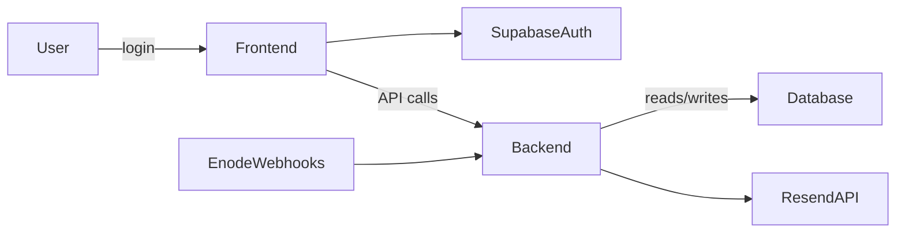

# EVLinkHA Architecture Overview

This document provides a high-level view of the EVLinkHA system architecture, including components, data flow, and deployment topology.

## Components

1. **Frontend (Next.js 15)**

   * Serves UI: Dashboard, Login, /me, Profile pages
   * Uses React hooks for authentication (`useAuth`)
   * Real-time updates via Supabase realtime or polling

2. **Backend (FastAPI)**

   * API endpoints:

     * `/me` – user profile and settings
     * `/api/vehicles` – list and status of user vehicles
     * `/api/status/{vehicle_id}` – detailed status for a single vehicle
     * `/api/user/{user_id}` – CRUD for user settings (e.g., `notify_offline`)
     * Webhook endpoint for Enode events

3. **Database (Supabase/PostgreSQL)**

   * Tables:

     * `users` (id, email, name, notify\_offline, accepted\_terms, approved)
     * `vehicles` (vehicle\_id, user\_id, vendor, online, vehicle\_cache, updated\_at)
     * `webhook_events` (id, user\_id, vehicle\_id, event\_type, payload, created\_at)

4. **Authentication (Supabase Auth)**

   * Magic Link, GitHub, Google OAuth
   * JWT access token for API requests

5. **Email Service (Resend API)**

   * Sends offline notifications
   * Can be extended for SMS in future

## Data Flow

## Deployment Topology

* **Staging**

  * Domain: `staging.evlinkha.se`
  * Branch: `staging`
  * GitHub Action: `deploy-staging.yml`

* **Production**

  * Domain: `evlinkha.se`
  * Branch: `main`
  * GitHub Action: `deploy-production.yml`

## Hosting and Infrastructure

* **Frontend:** Vercel or Netlify
* **Backend:** VPS with systemd + uvicorn
* **Database:** Supabase cloud instance
* **CI/CD:** GitHub Actions

---

*For detailed API spec, see `docs/API_SPEC.md`.*
