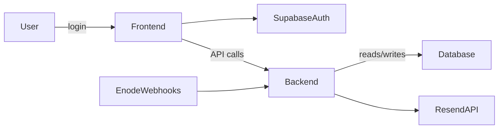

# EVLinkHA Architecture Overview

This document provides a high-level view of the EVLinkHA system architecture, including components, data flow, and deployment topology.

## Components

1. **Frontend (Next.js 15)**

   * Serves UI: Dashboard, Login, /me, Profile pages
   * Uses React hooks for authentication (`useAuth`)
   * Real-time updates via Supabase Realtime, using `supabase.channel().on('postgres_changes', ...)` for database changes.
     * For `INSERT` events (e.g., `poll_logs`), a refetching strategy is used to update aggregated data.
     * For `UPDATE` events (e.g., `users.purchased_api_tokens`), direct state updates from the payload are used.

2. **Backend (FastAPI)**

   * API endpoints:

     * `/me` – user profile and settings
     * `/api/vehicles` – list and status of user vehicles
     * `/api/status/{vehicle_id}` – detailed status for a single vehicle
     * `/api/user/{user_id}` – CRUD for user settings (e.g., `notify_offline`)
     * Webhook endpoint for Enode events

3. **Database (Supabase/PostgreSQL)**

   * Tables:

     * `users` (id, email, name, notify_offline, accepted_terms, approved)
     * `vehicles` (vehicle_id, user_id, vendor, online, vehicle_cache, updated_at)
     * `webhook_events` (id, user_id, vehicle_id, event_type, payload, created_at)

4. **Authentication (Supabase Auth)**

   * Magic Link, GitHub, Google OAuth
   * JWT access token for API requests

5. **Email Service (Resend API)**

   * Sends offline notifications
   * Can be extended for SMS in future

## Frontend Component Architecture

To ensure a maintainable and scalable frontend, we adhere to the following component structure and design principles.

### Naming Convention
- **`PascalCase`**: All component files and named exports must use PascalCase (e.g., `UserInfoCard.tsx`).

### Folder Structure
Components are organized by their purpose and scope within `frontend/src/components/`:

- **`ui/`**: Generic, reusable UI building blocks, primarily from libraries like ShadCN (e.g., `Button`, `Card`).
- **`shared/`**: Application-specific components that are reused across multiple features (e.g., `PageTitle`, `LoadingSpinner`).
- **`layout/`**: Components that define the overall page structure (e.g., `Sidebar`, `Navbar`, `Footer`).
- **`[feature-name]/`**: Components that are specific to a particular feature or domain (e.g., `profile/`, `dashboard/`). If a feature becomes complex, it can have its own subdirectories.
- **Page-specific components**: For components used by a single `page.tsx`, they can reside in a `components/` subdirectory within the page's route segment (e.g., `app/(app)/profile/components/`).

### Design Principles
- **Small & Focused**: Components should be small and have a single responsibility.
- **Props-Driven**: Components should primarily be controlled via props to promote reusability and predictable state.
- **Client vs. Server**: Be mindful of the `'use client'` and `'use server'` directives to optimize rendering and data fetching.

## Data Flow

## Deployment Topology

* **Staging**

  * Domain: `staging.evlinkha.se`
  * Branch: `staging`
  * GitHub Action: `deploy-staging.yml`

* **Production**

  * Domain: `evlinkha.se`
  * Branch: `main`
  * GitHub Action: `deploy-production.yml`

## Hosting and Infrastructure

* **Frontend:** Vercel or Netlify
* **Backend:** VPS with systemd + uvicorn
* **Database:** Supabase cloud instance
* **CI/CD:** GitHub Actions

---

*For detailed API spec, see `docs/API_SPEC.md`.*
